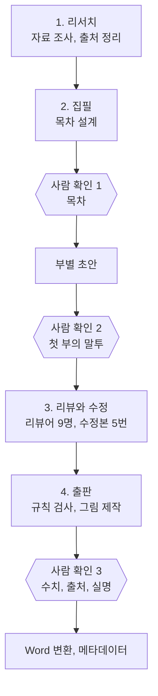
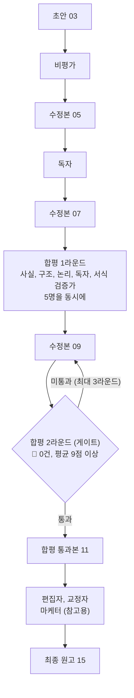
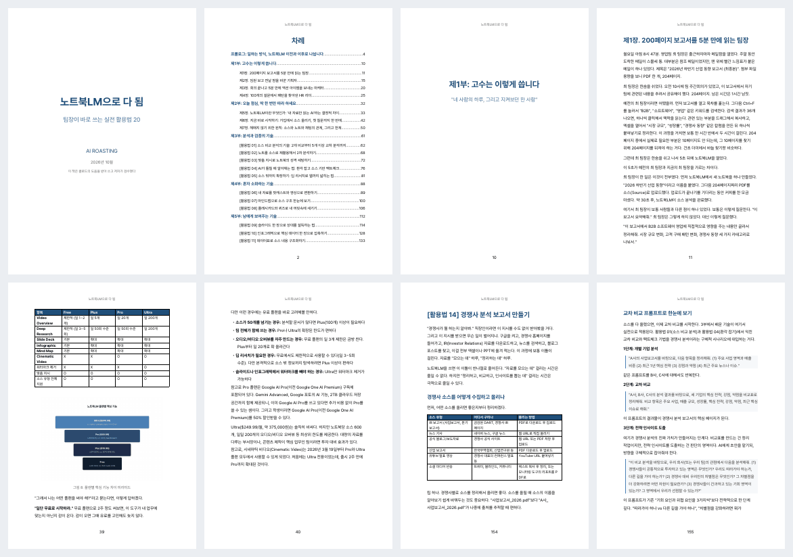

<p align="center">
  
</p>

<p align="center">
  
  
  
</p>

# book-publishing

book-publishing은 AI 에이전트 팀이 한국어 책 한 권을 자료 조사부터 Word 원고까지 만드는 스킬입니다. 사용자는 "책 써줘"라고 말하고, 방향이 갈리는 세 지점에서 확인만 합니다.

## 하는 일

- **조사와 집필**: AI가 사용자의 자료와 웹 자료를 조사하고, 목차를 설계하고, 원고를 씁니다.
- **검수**: 리뷰어 9명이 원고를 읽고 지적합니다. 점수는 AI가 아니라 스크립트가 지적 개수로 계산합니다.
- **출판**: 검사기가 서식과 사실 규칙을 확인하고, 변환기가 사실 확인을 마친 원고만 Word 문서로 바꿉니다.

## 워크플로

책 한 권은 4단계, 18개 작업을 거칩니다. 다음에 할 작업은 AI가 아니라 스크립트(`book.py status`)가 완료 표시를 보고 정합니다.



| 단계 | 하는 일 | 산출물 |
|------|---------|--------|
| 1 리서치 | 사용자 자료와 웹 자료를 조사하고 출처를 기록합니다 | `01_research-notes.md`, `01_citations.json` |
| 2 집필 | 목차를 설계하고, 부마다 초안을 쓴 뒤 하나로 합칩니다 | `02_outline.md`, `03_draft-v1.md` |
| 3 리뷰 | 리뷰어가 지적하고, 메인 에이전트가 지적된 부만 고쳐 씁니다 | `04`~`14` 리뷰와 수정본, `15_manuscript.md` |
| 4 출판 | 규칙을 검사하고, 그림을 만들고, 사실 확인을 받은 뒤 변환합니다 | `final.docx`, `fact-check.md`, `metadata.md` |

## 에이전트 구조

```
메인 에이전트 (진행과 집필)
├── 조사, 목차 설계, 초안 작성, 지적 반영
├── 스크립트 호출
│   ├── book.py        다음 작업 판정, 리뷰 점수 계산, 원고 병합, 승인 기록
│   ├── verify.py      원고 규칙 검사 (목차, 말투, 수치와 출처, 실명, 금지 용어)
│   ├── figure_kit.py  그림 제작과 그림 속 글자 기록
│   └── build_docx.py  Word 변환과 변환 후 검사
└── 리뷰 서브에이전트 9명 (+ 참고용 마케터)
```

메인 에이전트는 원고를 쓰고 고치지만, 자기 원고를 평가하지 않습니다. 평가는 리뷰 서브에이전트가 하고, 점수 계산과 단계 판정은 스크립트가 합니다.

### 리뷰 서브에이전트



| 순서 | 리뷰어 | 띄우는 방식 | 지적을 반영한 원고 |
|------|--------|-------------|---------------------|
| 1 | 비평가 | 1명 | `05_draft-v2` |
| 2 | 독자 | 1명 | `07_draft-v3` |
| 3 | 합평 1라운드: 사실, 구조, 논리, 독자, 서식 검증가 | 5명 동시 | `09_draft-v4` |
| 4 | 합평 2라운드 (게이트): 같은 5명 | 5명 동시 | `11_draft-final` |
| 5 | 편집자, 교정자, 마케터(참고용) | 각 1명 | `15_manuscript` |

- 서브에이전트는 원고 경로, 자기 평가 기준, 출력 형식만 받습니다. 다른 리뷰어의 의견은 받지 않습니다.
- 서브에이전트는 지적만 쓰고 점수는 쓰지 않습니다. `book.py`가 지적마다 번호를 붙이고, 🔴과 🟡의 개수로 점수를 계산합니다.
- 메인 에이전트는 서브에이전트의 결과를 요약하거나 고치지 않고 리뷰 파일에 그대로 옮깁니다. 형식이 어긋나면 같은 리뷰어를 다시 띄웁니다.
- 합평은 🔴 0건, 평균 9점 이상이어야 통과합니다. 2라운드에서 통과하지 못하면 3라운드까지 다시 고치고 리뷰합니다.
- 마케터의 의견은 본문에 반영하지 않고 소개문과 키워드(`metadata.md`)에만 씁니다.
- Claude 앱과 ChatGPT는 서브에이전트를 띄울 수 없습니다. 이때는 한 AI가 역할을 바꿔 가며 순서대로 리뷰하고, 리뷰 파일에 '격리 없음'을 기록합니다.

## 설치

| 환경 | 방법 |
|------|------|
| Claude Code | 아래 문장을 Claude Code에 붙여 넣습니다. |
| Claude 앱 | 이 페이지의 **Code > Download ZIP**으로 ZIP을 받습니다. **설정 > 기능**에서 코드 실행을 켜고, **사용자 지정 > 스킬 > 스킬 업로드**로 ZIP을 올립니다. |
| ChatGPT | 같은 ZIP을 **플러그인 > 스킬 > 컴퓨터에서 업로드**로 올립니다. |

```
https://github.com/airoasting/book-publishing
이 저장소를 내 스킬 폴더(~/.claude/skills/book-publishing)에 내려받고, scripts/requirements.txt의 파이썬 패키지도 설치해줘
```

- 회사 계정에서는 관리자가 '스킬'과 '코드 실행'을 허용해야 메뉴가 보입니다.
- Mac Safari가 ZIP을 자동으로 풀면, Safari 설정 > 일반 > '다운로드 후 안전한 파일 열기'를 끄고 다시 받습니다.
- Word 변환에는 python-docx와 matplotlib가 필요합니다. Claude 앱과 ChatGPT에는 보통 이미 들어 있습니다. LibreOffice가 있으면 PDF와 실제 쪽수도 만듭니다.

## 사용법

### 1. 시작

Claude Code에서는 책을 쓸 폴더를 열고, 앱에서는 새 대화를 엽니다. 그다음 "책 써줘"라고 말합니다.

### 2. 인터뷰

AI가 아래 항목을 하나씩 묻고, 답을 모아 책 설정 파일(`user_input/user-book-toc.md`)을 만듭니다.

- 주제와 독자
- 화자: 실제 저자, 가상 화자, 조직 화자(사내 가이드북) 중 하나
- 말투
- 쓰면 안 되는 것: 회사명, 고객사, 프로젝트명 (영문명과 약칭 포함)
- 분량, 판형, 제목

사내 문서나 메모가 있으면 AI에게 줍니다. Claude Code에서는 `user_input/sources/` 폴더에 넣고, 앱에서는 채팅에 첨부합니다. 넣은 자료는 사용 중인 AI 서비스로 전송되므로, 회사의 AI 사용 정책을 먼저 확인합니다.

### 3. 세 번의 확인

| 시점 | 확인할 것 |
|------|-----------|
| 목차 설계 직후 | 부와 장의 구성, 분량 배분 |
| 첫 부 집필 직후 | 문체와 말투 |
| 출판 직전 | 수치와 출처, 그림 속 글자, 실명일 수 있는 이름, AI 제작 고지 |

나머지 단계는 AI가 진행합니다. AI가 멈추면 "이어서 해줘"라고 말합니다.

### 4. 결과물

결과물은 작업 폴더의 `output/{날짜}/`에 생깁니다.

- `final.docx`: 표지, 차례, 본문, 그림, 출처 목록이 든 원고
- `final.pdf`: LibreOffice가 있을 때 함께 생기는 PDF
- `fact-check.md`: 출판 직전에 보는 사실 확인 표
- `metadata.md`: 소개문, 검색 키워드, 분류 코드, 등록 체크리스트

<p align="center">
  
</p>

## 중간에 끊겼을 때

- **Claude Code**: 새 대화에서 "책 이어서 써줘"라고 하면, AI가 끊긴 곳부터 이어 씁니다.
- **Claude 앱, ChatGPT**: AI가 단계마다 작업 묶음 ZIP을 만들어 줍니다. 다음 대화에 가장 최근 ZIP을 올리고 "책 이어서 써줘"라고 하면, AI가 그 시점부터 이어 씁니다.

## 품질 장치

1. 리뷰어 9명은 서로의 의견을 보지 않고 원고를 읽습니다 (위의 '리뷰 서브에이전트').
2. 반드시 고칠 지적(🔴)은 원고에서 실제로 고쳐야 다음 단계로 넘어갑니다.
3. 수치에는 출처가 붙습니다. 출처 기록과 다른 수치는 사실 확인 표에 ⚠️로 표시됩니다.
4. 검사기는 원고, 그림 속 글자, 출처 목록, 완성된 Word 문서에서 실명과 금지 용어를 같은 기준으로 찾습니다.
5. 승인한 뒤 원고, 그림, 출처, 설정 중 하나라도 바뀌면, 승인이 풀리고 다시 확인을 받습니다.

## 한계

- 이 스킬은 사실 오류와 정보 유출이 없다고 보장하지 않습니다. 책의 최종 책임은 저자에게 있습니다.
- 검사기는 글자로 된 내용만 읽습니다. 그림에 붙인 캡처 화면, 스캔 PDF, 한글(HWP) 파일 속 글자는 사람이 사실 확인 표의 ⚠️ 항목에서 직접 확인해야 합니다.
- 어미 검사 같은 일부 검사는 한국어 원고를 전제로 합니다.

## 폴더 구성

```
book-publishing/
├── SKILL.md          스킬 작동 규칙
├── references/       단계별 실행 문서 (조사, 집필, 리뷰, 출판)
├── scripts/          상태 판정, 검사기, Word 변환기, 그림 도구
├── user_input/       책 설정 템플릿
├── example/          240쪽 예시 책의 설정과 결과물 PDF
├── assets/           README 이미지
└── tests/            회귀 테스트
```

작업 폴더에는 `user_input/`(책 설정과 자료), `draft/`(작업 기록), `output/`(결과물)이 생깁니다.

## 버전

| 버전 | 날짜 | 변경 |
|------|------|------|
| 4.0 | 2026-10-03 | Claude Code, Claude 앱, ChatGPT 설치 구조. 상태 판정과 점수 계산을 스크립트로 옮김. Word 변환, 사실 확인 표, 실명과 금지 용어 검사 추가 |
| 3.0 | 2026-07-11 | 주소 하나로 설치. 검사 규칙을 책 설정 파일에서 읽음 |
| 2.0 | 2026-05-04 | 이어 쓰기 표시, 원고 자동 검사, 리뷰어 9명 기준 |
| 1.0 | 2026-03-13 | 조사부터 초안까지의 기본 흐름 |

## 라이선스

Apache License 2.0
